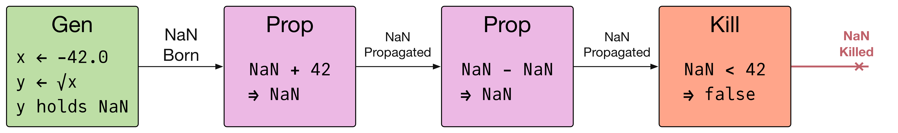
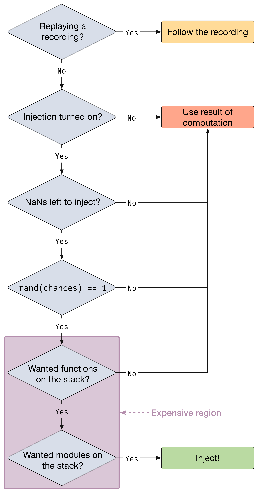

# FloatTracker.jl

[](https://github.com/utahplt/FloatTracker.jl/actions/workflows/CI.yml)

Track `NaN` and `Inf` generation and propagation in your code.

Available on [JuliaHub](https://juliahub.com/ui/Packages/FloatTracker/dBXig/1.0.0)

# Synopsis

```julia
# Pull in FloatTracker
using FloatTracker

# Wrap inputs in a TrackedFloat* type
num = TrackedFloat64(-42.0)

# Watch as a NaN gets born
should_be_nan = sqrt(num)

# Flush FloatTracker's logs
ft_flush_logs()
```

# Description

`FloatTracker.jl` is a library that provides three new types: `TrackedFloat16`, `TrackedFloat32`, and `TrackedFloat64`.
These behave just like their `FloatN` counterparts except that they detect and log instances of exceptional floating point values. (E.g. `NaN` or `Inf`)

There are three kinds of events that can happen during the lifetime of an exceptional floating point value:



- **GEN**: the operation generated an exceptional value as a result (e.g. `0.0 / 0.0 → NaN`)
- **PROP**: the operation propagated an exceptional value from arguments to result (e.g. `NaN + 2.0 → NaN`, `2.0 / 0.0 → Inf`)
- **KILL**: the operation had an exceptional value in its arguments but not in its result (e.g. `NaN > 1.0 → false`)

These events are then stored in a buffered log and can be written out to a file during or after the execution of a program.

JuliaCon 2023 talk by Ashton:

[](https://www.youtube.com/live/rMrHCM1Etng?si=fK0Y3WYiFOzJYQ4V&t=10147)


## Example
```julia
using FloatTracker

config_logger(filename="max")

function maximum(lst)
  max_seen = 0.0
  for x in lst
    if ! (x < max_seen)
      max_seen = x              # swap if new val greater
    end
  end
  max_seen
end

function maximum2(lst)
  foldl(max, lst)
end

println("--- With less than ---")
res = maximum(TrackedFloat32.([1, 5, 4, NaN, 4])).val
println("Result: $(res)")
println()

println("--- With builtin max ---")
res2 = maximum2(TrackedFloat32.([1, 5, 4, NaN, 4])).val
println("Result: $(res2)")

ft_flush_logs()
```

This code shows two different implementations of a max-element function.
One uses the builtin `<` operator and the other uses Julia's `max` function. When encountering a `NaN` the `<` will "kill" it (always returning `false`) and the `max` function will "prop" it (always returning back the `NaN`).

Note that the result of this program is *wrong*: instead of the true maximum value of the list (`5.0`) getting returned, the bad version returns `4.0`!

We can see this in the log that produced by FloatTracker when running this file.

```
[NaN] check_error at /Users/ashton/.julia/dev/FloatTracker/src/TrackedFloat.jl:11
< at /Users/ashton/.julia/dev/FloatTracker/src/TrackedFloat.jl:214
maximum at /Users/ashton/Research/FloatTrackerExamples/max_example.jl:0
top-level scope at /Users/ashton/Research/FloatTrackerExamples/max_example.jl:20
eval at ./boot.jl:370
include_string at ./loading.jl:1899
_include at ./loading.jl:1959
include at ./Base.jl:457
exec_options at ./client.jl:307
_start at ./client.jl:522

…
```

This is an example of a program where two different implementations can result in a different answer when dealing with `NaN` in the input. In a larger program, the presence of `NaN` can produce incorrect results.
This tool may be useful for debugging those sorts of issues.

## Usage

 1. Call `using FloatTracker`; you may want to include functions like `enable_nan_injection` or `config_logger` or the like. (See below for more details.)
 2. Add additional customization to logging and injection.
 3. Wrap as many of your inputs in `TrackedFloatN` as you can.

FloatTracker should take care of the rest!

Digging into step 2, there are two things that you can customize after initialization:

 - **The logger**

   Determines what and how events are captured and logged.

 - **The injector**

   Optional—default is to not inject. If you want to try injecting NaNs to fuzz your code, this is where you control when that happens.


### Configuring the logger

```julia
# Set log file basename to "whatever"; all log files have the timestamp prepended
config_logger(filename="whatever")

# There are three kinds of events that we log:
#  - `:gen`  → when a NaN gets created from non-NaN arguments
#  - `:prop` → when a NaN argument leads to a NaN result
#  - `:kill` → when a NaN argument does *not* lead to a NaN result
#
# If logs are too noisy, we can disable some or all of the logs. For example,
# here we disable everything but NaN generation logging:
exclude_stacktrace([:prop,:kill])
```

Keyword arguments for `config_logger`:

 - `filename::String` Basename of the file to write logs to.

   Constructors automatically prefix the timestamp to the beginning of this
   basename so the logs are grouped together chronologically.

 - `buffersize::Int` Number of logs to buffer in memory before writing to file.

   Defaults to 1000. Decrease if you are crashing without getting the logs that you need.

 - `printToStdOut::Bool` Whether or not to write logs to STDOUT; defaults  to `false`.

 - `cstg::Bool` Write logs in CSTG format.

 - `cstgLineNum::Bool` Include the line number in CSTG output.

 - `cstgArgs::Bool` Include arguments to functions in CSTG output.

 - `maxFrames::Union{Int,Unbounded}` Maximum number of frames to print per even in the logs; defaults to `Unbounded`.

 - `maxLogs::Union{Int,Unbounded}` Maximum number of events to log; defaults to `Unbounded`.

 - `exclusions::Array{Symbol}` Events to not log; defaults to `[:prop]`.

### Configuring the injector

FloatTracker can *inject* `NaN`s at random points in your program to help you find places where you might not be handling exceptional values properly: this technique can help you find `NaN` kills before they happen in a production environment.

```julia
# Inject 2 NaNs
enable_nan_injection(2)

# Inject 2 NaNs, except when in the function "nope" in "way.jl"
enable_nan_injection(n_inject=2, functions=[FunctionRef("nope", "way.jl")])

# Enable recording of injections
record_injection("ft_recording") # this is just the file basename; will have timestamp prepended

# Enable recording playback
replay_injection("20230530T145830-ft_recording.txt")
```

Keyword arguments for `config_injector`:

 - `active::Boolean` inject only if true

 - `n_inject::Int` maximum number of NaNs to inject; gets decremented every time
   a NaN gets injected

 - `odds::Int` inject a NaN with 1:odds probability—higher value → rarer to
   inject

 - `functions::Array{FunctionRef}` if given, only inject NaNs when within these
   functions; default is to not discriminate on functions

 - `libraries::Array{String}` if given, only inject NaNs when within this library.

 - `record::String` if given, record injection invents in a way that can be
   replayed later with the `replay` argument.

 - `replay::String` if given, ignore all previous directives and use this file
   for injection replay.

`functions` and `libraries` work together as a union: i.e. the set of possible NaN
injection points is a union of the places matched by `functions` and `libraries`.

## Known operations that can kill a NaN

```
1.0 ^  NaN → 1.0
NaN ^  0.0 → 1.0
1.0 <  NaN → false
1.0 >  NaN → false
1.0 <= NaN → false
1.0 >= NaN → false
```

Most of the time comparison operators are what kill a NaN. But `^` can kill NaNs too.

# Fuzzing and Recording injections

FloatTracker allows you to fuzz code and inject NaNs or Infs wherever a `TrackedFloat` type is used. Moreover, you can record these injections to rerun injections.

**WARNING:** it is critical that inputs to the program be exactly the same for recording and replaying to be consistent. The recordings are sensitive to the number of times a floating point operation is hit.


## Injection decision

This diagram shows how we decide at a given point whether or not to inject a NaN:



The checks in the purple region cost the most time, so we do those as late as possible.

## Recording sessions

Sometimes we want to inject NaNs throughout the program. We can create a "recording session" that will before each injection check if that point has been tried before. If it has, we move on and try again at the next injection point.

We can tell FloatTracker what we consider to be identical injection points. **TODO:** how *do* we tell FloatTracker what we consider to be the same and not the same? Function boundaries?

## Recording internals

During recording and replaying, we increment a counter each time a floating point operation happens. This doesn't add much overhead [*citation needed*] since we're already intercepting each of the floating point calls anyway—but it explains why we need to make sure our programs are deterministic before recording and replaying.

Injection points are saved to a *recording file*, where each line denotes an injection point. Example:

```
42, solve.jl, OrdinaryDiffEq::solve OrdinaryDiffEq::do_it Finch::make_it_so
```

The first field `42` is the injection point, or the nth time a floating point operation was intercepted by FloatTracker. The second field `solve.jl` acts as a little sanity check: this is the first non-FloatTracker file off of the stack trace. After that comes a list of module names paired with the function on the call stack.

# Generating CSTGs

Get the [CSTG](https://github.com/utahplt/cstg) code.

Run a program that uses TrackedFloats (e.g. from the [example repository](https://github.com/utahplt/FloatTrackerExamples)).
By default, a file with `*error_log*` in its name should appear.

Generate a graph using the error log:

```
./path/to/tracerSum *-program_error_log.txt output_basename
# prints many lines to stdout
```

Open `output_basename.pdf` to see the CSTG.

For more about CSTG, please see the original paper:

> Alan Humphrey, Qingyu Meng, Martin Berzins, Diego Caminha Barbosa De Oliveira, Zvonimir Rakamaric, Ganesh Gopalakrishnan:
> Systematic Debugging Methods for Large-Scale HPC Computational Frameworks. Comput. Sci. Eng. 16(3): 48-56 (2014)

# Examples

Examples have been moved from this repository to an [example repository](https://github.com/utahplt/FloatTrackerExamples)—this allows us to keep the dependencies in this repository nice and light.

# Julia and GPU programming

FloatTracker works on the CPU. If a Julia function calls a GPU kernel, then you can track exceptions inside the GPU execution using our companion tool [GPU-FPX](https://github.com/LLNL/GPU-FPX) developed by Xinyi Li for her PhD. This will allow you to (1) see the exception flows inside the kernel, (2) whether the exceptions got killed inside the kernel, and if the exceptions were present in the return result of the Julia GPU call, then (3) FloatTracker will show how that exception further flows through the Julia code. You get this full effect by running your Julia Command under `LD_PRELOAD`. 

For details of `LD_PRELOAD` and to obtain and install GPU-FPX, please visit the [GPU-FPX repository](https://github.com/LLNL/GPU-FPX) and ask its authors for assistance if needed. For help on using FloatTracker in conjunction with this tool, talk to us.

# Running tests

You can run tests one of two ways:

```
$ julia --project=. test/runtests.jl
```

or via the Julia shell:

```
julia> ]             # enter the package shell
pkg> activate .
(FloatTracker) pkg> test
```

# License

MIT License

# History

Inspired by [Sherlogs.jl](https://github.com/milankl/Sherlogs.jl).

This repository originally lived in [Taylor Allred's repository](https://github.com/tcallred/FloatTracker.jl).

# Citation

If you use this library in your work, please cite us:

> (citation forthcoming)

# Acknowledgments

This work was performed under the auspices of the U.S. Department of Energy by the University of Utah under Award DE-SC0022252 and NSF CISE Awards 1956106, 2124100, and 2217154.

# Authors

 - [Taylor Allred](https://github.com/tcallred)
 - [Ashton Wiersdorf](https://github.com/ashton314)
 - [Xinyi Li](https://github.com/xinyi-li7) (GPU-FPX)
 - [Ben Greenman](https://github.com/bennn)
 - [Ganesh Gopalakrishnan](https://users.cs.utah.edu/~ganesh/)
